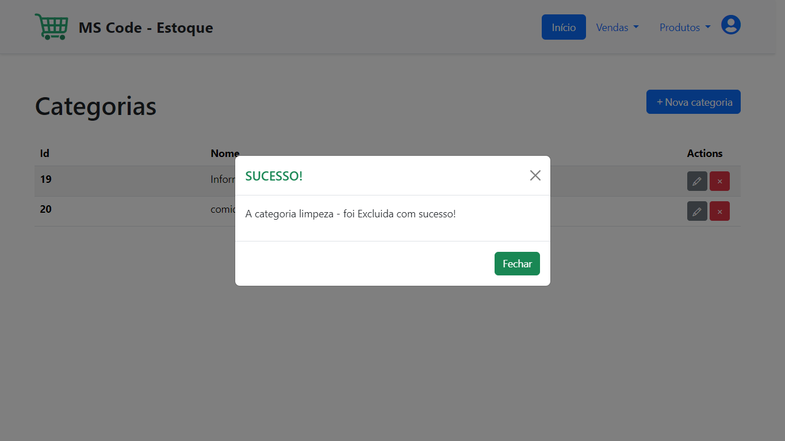

# Documentação do Projeto

O projeto **MS-CODE-ESTOQUE** é um sistema de gerenciamento de estoque desenvolvido com a estrutura **MVC** (Model-View-Controller) utilizando **PHP**, **HTML**, **CSS** e **JavaScript**. O sistema permite a gestão de categorias e produtos, oferecendo funcionalidades para adicionar, editar e excluir itens, além de gerenciar o estoque de produtos.

Abaixo estão as imagens e capturas de tela relacionadas ao sistema, organizadas em seções para facilitar a navegação e compreensão das funcionalidades oferecidas.

## Login/Cadastro

### Tela de Login

Esta é a tela inicial onde os usuários fazem login.

### Tela de Cadastro

Tela onde os novos usuários se cadastram.

### Pop-up de Erro na Senha

Pop-up exibido quando a senha inserida está incorreta.

### Pop-up de Sucesso no Cadastro

Pop-up exibido quando o cadastro é realizado com sucesso.

## Categoria

### Adicionar Categoria

Tela para adicionar novas categorias ao sistema.

### Editar Categoria

Pop-up para editar informações de uma categoria existente.

### Confirmação de Exclusão de Categoria

Pop-up de confirmação para a exclusão de uma categoria.

### Categoria Excluída com Sucesso

Pop-up exibido após a exclusão bem-sucedida de uma categoria.

## Produtos

### Adicionar Novo Produto

Tela para adicionar um novo produto ao sistema.

### Página Inicial de Produtos

Tela inicial que exibe a lista de produtos.

### Pop-up de Sucesso ao Inserir Produto

Pop-up exibido quando um novo produto é adicionado com sucesso.

### Pop-up de Confirmação para Exclusão de Produto

Pop-up de confirmação para a exclusão de um produto.

### Pop-up de Sucesso ao Excluir Produto

Pop-up exibido após a exclusão bem-sucedida de um produto.

### Pop-up de Aumento de Estoque

Pop-up exibido quando o estoque de um produto é aumentado.

### Pop-up de Diminuição de Estoque

Pop-up exibido quando o estoque de um produto é diminuído.

### Pop-up de Edição de Produto

Pop-up exibido para editar as informações de um produto.

## Menu Lateral

### Informações do Usuário no Menu Lateral

Tela mostrando as informações do usuário no menu lateral.

---
